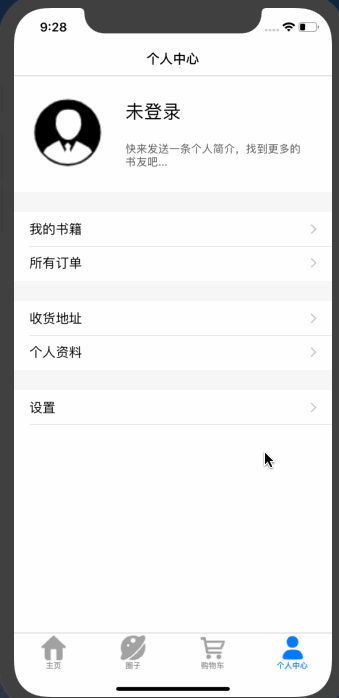
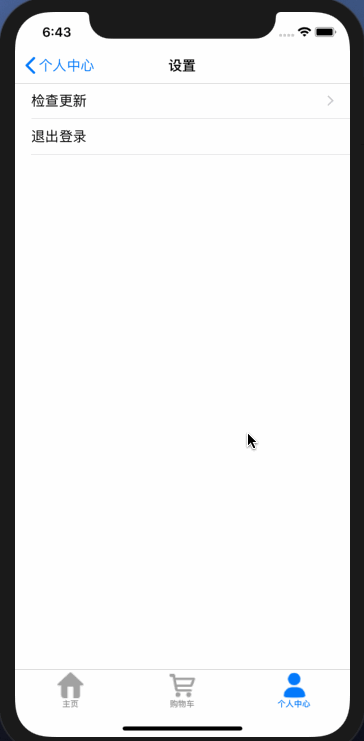
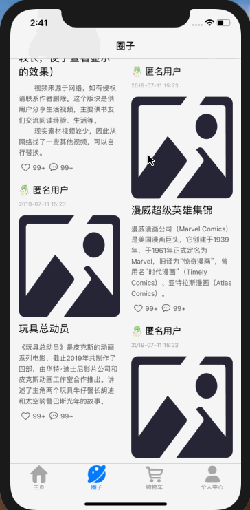

## IOS Swift 书店购书App

#### I 基础设置
语言版本：swift 4.0及以上

Xcode版本：10.0 及以上

最佳虚拟机型：iPhone 8 plus、iPhone XR

适合IOS初学者，有很多不成熟的写法，欢迎提issue指出问题～～

#### II 演示

- 登录、修改个人资料：

- 浏览图书、搜索、添加购物车、结算：

- 退出登录、注册新用户：

- 瀑布流布局，点击后播放对应的视频：

#### III 目录结构

主要说明一下 bookshop 文件夹下各个目录的划分。

/src：各个页面主要的代码都保存在这里，以页面名称命名
/src/common：一些公用的方法和类，比如User、Book这些实体类，以及以Util结尾的工具类。其中CommonUtil.swift 暂时替代后端服务，提供请求接口，模拟远程请求。
/src/home：主页（底部第一栏）
/src/circle：圈子（第二栏）
/src/shoppingcar：购物车（第三栏）
/src/user：个人中心（第四栏）

#### VI 其他

> 使用注意1：很多控件直接使用故事板（storyboard）拖拽放置，尽管已经使用AutoLayout进行布局，能兼容大部分屏幕尺寸，但还是建议使用 iPhone 8 plus/xr 的机型，布局能达到最好的效果。

> 使用注意2：Config.swift 文件有一些作者信息，使用时注意修改。

项目中引入的其他项目代码均已注明出处，侵权请联系本人删除。

###### Copyright © 2019 - 2020 许家乐
